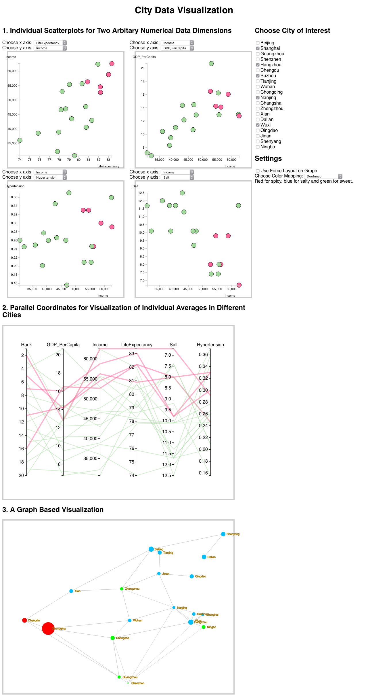

# A_02 Report

何昊 1600012742

## Dataset

All the data are collected from the Internet and are not guaranteed to be accurate. All available data types are summarized in the following table. For raw data, see `City.csv` in project root.

| Data                        | Type        | Metric                | Source           |
| --------------------------- | ----------- | --------------------- | ---------------- |
| City Overall Rank        | Ordinal Num | /                    | Baidu |
| Chinese Name                | String      | /                     | Common Knowledge |
| English Name                | String      | /                     | Common Knowledge |
| Location                    | 2D Vector   | (N,E)                 | Baidu            |
| Area                        | Ordinal Num | 10^4 KM^2             | Baidu            |
| Population                  | Ordinal Num | 10^4                  | Baidu            |
| GDP                         | Ordinal Num | 10^4 Yuan             | Wikipedia        |
| GDP per Capita              | Ordinal Num | 10^4 Yuan             | Baidu            |
| Income                      | Ordinal Num | Yuan                  | Baidu            |
| Life Expectancy             | Ordinal Num | Year                  | Wikipedia        |
| Salt Intake                 | Ordinal Num | g                     | Reference [1]    |
| Hypertension Incidence      | Ratio       | /                     | Baidu            |
| Zongzi(粽子) Perference     | Nominal     | {Salty, Sweet}        | Common Knowledge |
| Doufunao(豆腐脑) Perference | Nominal     | {Salty, Sweet, Spicy} | Common Knowledge |
| High-Speed Railway Network  | Graph       | /                     | Baidu |

There are 15 data dimensions in total. First, city rank, chinese name, english name, location, area, population, GDP, GDP per capita, income, and life expectancy are 10 fundamental data dimensions for describing a city. Second, because I'm also interested in food perferences of people in different cities, I also collected the following 4 data dimensions: salt intake, hypertension incidence, Zongzi perference, and Dofunao perference. Finally, since we also need to visualize connections between city, I collected High-Speed Railway Network connection data, which is a graph. In this graph, only cities that have direct high-speed railway lines(i.e. no intermediate cities) have a link.

From these data, I want to leverage visualization to analyze the following:

1. The correlationship among city food perference(e.g. salt intake), city economy status(e.g. income), and city medical data(e.g. hypertension incidence). Then we can see whether there are any interesting conclusions.
2. The distribution of food perferences over geology regions, which can be seen using a graph visualization.

## Methods

### View 1: Multiple Scatterplots

Scatterplots can be used to effectively visualize correlations of two quantitative data dimensions. In order to visualize high dimension data, more than one scatterplots need to be used. Initially, I want to visualize using a scatterplot matrix. However, there are so many quantitative data dimensions that the matrix will be too complex and hard to analyze. Therefore, I decided to use 4 customizable scatterplots and let user choose the appropriate dimensions to visualize.

Visualized Data Dimensions: Rank, GDP, Area, Population, GDP Per capita, Income, LIfe Expectancy, Salt Intake, Hypertension Incidence.

### View 2: Parrallel Coordinates

Parrallel Coordinates are another effective way to visualize many data dimensions. It is especially effective to see trends of data over all dimensions with brushing and highlighting.

Visualized Data Dimensions: Rank, GDP Per capita, Income, LIfe Expectancy, Salt Intake, Hypertension Incidence.

### View 3: A High-Speed Railway Graph

This visualization is based on the High-Speed Railway connection data and geographic location of the cities. The user can choose between a fixed position layout and a force based layout. The size of each node represent the area of cities, and color of nodes can be used to encode many data dimensions, like food perferences(whichi is nominal data) and population density(which is numerical data). From the experiment I realized that the color channel is indeed ineffective in encoding numerical data. Also, this visualization can be easily extended to encode more data dimensions.

Visualized Data Dimensions: Chinese Name, English Name, Geographic Location, Area, Population, Zongzi Perference, Dofunao Perference.

### Interactions, Brushes and Links

Implemented interaction features include:

1. The user can choose a set of data using the configuration panel on the right. Any chosen city will be highlighted on scatterplots and parallel coordinates, which means these views are linked with each other.
2. Tooltips are implemented for scatterplots, and brushing are implemented for selection of data in parallel coordinates. The problem is that brushing and hovering are very hard to coexist. Therefore, current code have brushing implemented on scatterplots, but only tooltip features are enabled. 
3. In the graph visualization, the user can choose between a geographically based layout and a force based layout. In force based layout, the user can move any node to any position.

## Example Visualization Analysis

### 4 Individual Scatterplots and Its Data Dimensions

1. LifeExpectancy, Income
2. Income, GDP_per_Capita
3. Income, Hypertension
4. Income, Salt

### City of Interest

 Shanghai, Hangzhou, Suzhou, Nanjing, Wuxi

### Analysis

From the scatterplots we can clearly see correlations between life expectancy and income, income and GDP per capita, income and hypertension incidence. Also, we can see a negative correlation between income and salt intake(Beijing is a significant outlier however). These results means that cities with better economy tend to have higher life expectancy, less salt intake, but higher hypertension incidence. By choosing 5 cities from Shanghai, Jiangsu and Zhejiang, we can see from the visualization that these 5 cities are indeed the most well developed cities in China.

## Concluding Remarks

From doing this visualization, I learned basic web programming and visualization programming using D3. For me, the most impressing feature of Javascript and D3 is functional programming, which greatly simplified some otherwise very complicated code. Also, the decouple of code, UI and style using Javascript, HTML and CSS is also very interesting and elegant. The most difficult thing I've encountered in implementation is how to implement interactions, especially brushing and linking over all views. A proper design of code is needed to achieve this. Anyway, visualization programming is indeed very interesting.

## References

1. Hipgrave, David B., et al. "Salt and sodium intake in China." *Jama* 315.7 (2016): 703-705.
2. Stevens, Stanley Smith. "On the theory of scales of measurement." (1946): 677-680.
3. Schulz, H-J., and Heidrun Schumann. "Visualizing graphs-a generalized view." *Information Visualization, 2006. IV 2006. Tenth International Conference on*. IEEE, 2006.

